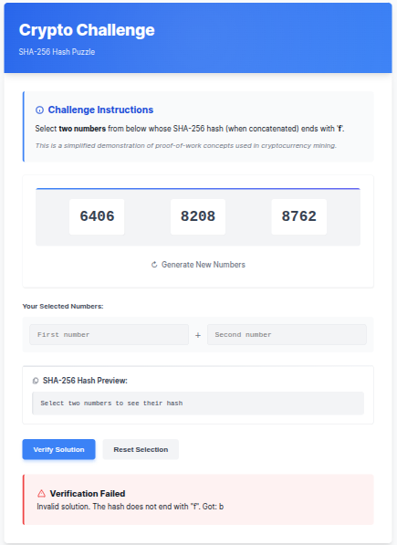

# CryptoCAPTCHA: Hash-Based Cryptographic Challenge

A web application that challenges users to solve SHA-256 hash puzzles, combining cryptographic concepts with interactive visualization.



## Overview

CryptoCAPTCHA is an educational tool demonstrating core cryptographic concepts like hashing and proof-of-work through an interactive puzzle interface. Users select pairs of numbers to find combinations whose concatenated SHA-256 hash ends with `f`, similar to simplified cryptocurrency mining challenges.

## Features

- **Interactive Hash Puzzle**: Select number combinations and instantly see their SHA-256 hash
- **Real-time Hash Visualization**: Watch the hash change as you select different number pairs
- **Visual Feedback**: Clear indications when a valid solution is found
- **HMAC Token Generation**: Successful solutions generate a cryptographically signed token as proof
- **Responsive Design**: Works seamlessly on desktop and mobile devices

## Project Structure

```
CryptoCAPTCHA/
│
├── src/                      # Source code directory
│   ├── app.py                # Flask application entry point
│   │
│   ├── templates/            # HTML templates
│   │   ├── base.html         # Base template with common structure
│   │   └── index.html        # Main challenge interface
│   │
│   ├── static/               # Static assets
│   │   ├── styles.css        # CSS styling
│   │   └── fonts/            # Custom fonts (optional)
│   │
│   └── utils/                # Utility functions
│       ├── __init__.py       # Package marker
│       ├── captcha.py        # CAPTCHA/challenge generation (if using images)
│       └── crypto.py         # Cryptographic functions (if separated)
│
├── requirements.txt          # Project dependencies
├── README.md                 # This documentation
└── .gitignore                # Git ignore configuration
```

## Technical Implementation

### Cryptographic Challenge

The core challenge is based on a simplified version of Bitcoin's proof-of-work concept:

1. The system presents three random numbers to the user
2. Users must find two numbers whose concatenation produces a SHA-256 hash ending with `f`
3. Upon finding a valid solution, the system generates an HMAC token as proof

### Technologies Used

- **Backend**: Python with Flask
- **Frontend**: HTML5, CSS3, JavaScript
- **Cryptography**: SHA-256 hashing (both server-side and client-side)
- **Security**: HMAC token generation for verified solutions

## Installation and Setup

1. Clone the repository:
   ```
   git clone https://github.com/yourusername/CryptoCAPTCHA.git
   cd CryptoCAPTCHA
   ```

2. Create a virtual environment (recommended):
   ```
   python -m venv venv
   source venv/bin/activate  # On Windows: venv\\Scripts\\activate
   ```

3. Install dependencies:
   ```
   pip install -r requirements.txt
   ```

4. Run the application:
   ```
   cd src
   python app.py
   ```

5. Open your web browser and navigate to `http://127.0.0.1:5000`

## Usage Guide

1. **Challenge Generation**:
   - When the page loads, three random numbers are displayed
   - Click "New Numbers" to generate a different set of numbers

2. **Finding a Solution**:
   - Click on two different numbers to select them
   - The hash preview will update in real-time
   - Look for combinations where the hash ends with "ff"

3. **Verification**:
   - Once you find a potential solution, click "Verify Solution"
   - If correct, you'll see a success message and a proof token
   - If incorrect, you'll see an error explaining why

4. **Understanding the Challenge**:
   - The difficulty can be adjusted by changing the target suffix
   - This demonstrates the core concept of cryptocurrency mining difficulty

## Educational Value

This project helps demonstrate several key concepts in cryptography:

- **Hash Functions**: One-way functions that produce fixed-length outputs
- **Hash Properties**: Unpredictability of outputs based on small input changes
- **Proof-of-Work**: Finding inputs that produce specific hash outputs
- **Digital Signatures**: Using HMAC for validating successful solutions

## Customization Options

The application can be customized in several ways:

- **Difficulty Level**: Change the required suffix from "ff" to require more specific endings
- **Number Range**: Modify the range of generated numbers
- **Visual Theme**: Customize the CSS to match your preferred style
- **Challenge Type**: Add different types of cryptographic puzzles

## License

This project is licensed under the MIT License - see the LICENSE file for details.

## Acknowledgements

- Inspired by cryptocurrency mining concepts
- Built with Flask and modern web technologies
- Special thanks to contributors and the cryptographic community

---